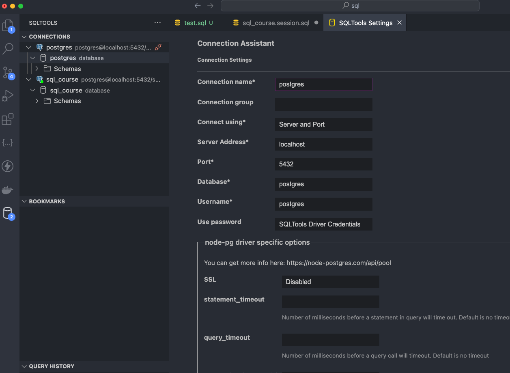

# SQL various samples

## [Installation of SQL and using extensionson VSCode](https://www.youtube.com/watch?v=7mz73uXD9DA&t=906s)

- Using SQL Tools with variable driver extensions to PostGreSQL, MySQL, SQLite, etc. We can use a single IDE to connect to multiple databases.
- [SQLTools Extension](https://marketplace.visualstudio.com/items?itemName=mtxr.sqltools)
- [SQLTools Postgres Driver Extension](https://marketplace.visualstudio.com/items?itemName=mtxr.sqltools-driver-pg)

## Connecting to PostgreSQL or any SQL database

